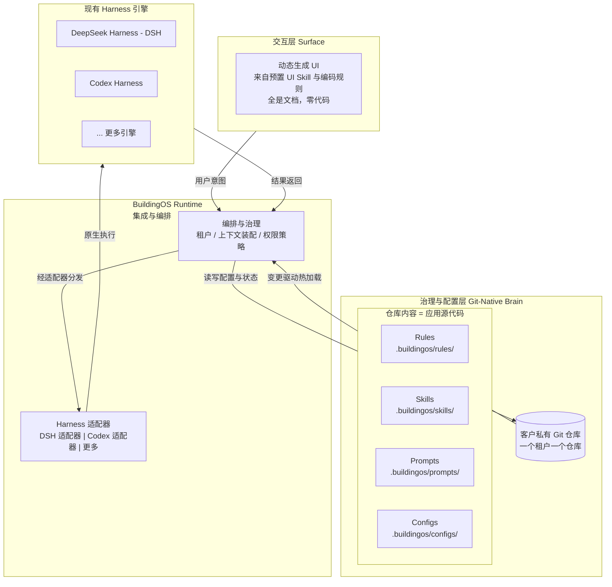

# BuildingOS

> **The AI-Native OS for Building Everything.**
>
> BuildingOS：面向企业级 AI 的开源 Harness 平台 —— 让企业 AI 与 Git 原生治理相遇。

[](LICENSE)
[]()
[]()

🌐 [English](README.md) | **中文**

---

## 这是什么

BuildingOS 是一个面向企业级 AI 的开源 **Harness as a Service / Agent as a Service** 平台。一句话：**让 AI 应用像代码一样可构建、可治理、可演进**。

**关键定位：把 AI Agent 封装成企业内部的"AI Server"。** DSH、Codex 等 Harness 正在把 AI Agent 变成企业内部的 AI Server——持久运行、有工具边界、可被程序化调用。BuildingOS 在此基础上**再封装一层稳定边界**：对外暴露统一 API，对内用 Git 治理 Harness 的 Markdown 文件（Skills、Rules 等）。引擎可以是 DSH、Codex 或未来的任何 Harness，但团队面对的始终是一台稳定、可协作的服务器。**我们不造发动机，我们把发动机封装成标准接口的服务器。**

接入 BuildingOS 之后，**三步即可产出产品**：① **一键部署整套 AI Server 环境**——Docker Compose / K8s 交付件捆绑 PostgreSQL、TDengine、MQTT 等配套服务（引擎可换）；② 用 Git 快速编写与治理自己的 **know-how**——把操作规程、专家经验写成 `skill.md` / `rule.md`（本质就是 how-to 描述），像改代码一样评审、版本化、回滚；③ 预置"顶级 UI"的 Skill 与编码规则（规范文档），前端由 Harness **动态生成**——admin web、dashboard 等**开箱即用，直接出原型产品**。**整个系统没有一句代码：全部是规范文档与配置文档。**

**AI 原生的项目生命周期——连"建系统"本身也是 AI 驱动。** 新项目：向导以对话收集"你要做一个什么系统"，自动产出**交付清单**、生成 Docker 部署文件并部署；老项目：指向现有 GitHub 仓库或文件夹，自动识别前后端技术栈、由 Harness 梳理后生成（或复用）部署文件并部署；运行中：改 `skill.md` / `rule.md` → PR → 热加载，系统持续演进。**从 demo 到企业级部署，全程由 Harness 迭代出来。**

**生产环境同样是 Harness 的主场。** 部署时自动给出生产环境部署要求与防火墙开放要求，附运行与升级方案；生产/测试服务器上同时运行这套 Harness，用于日志查看分析、bug 修复等日常运维——修复走完整闭环：服务器 Harness 查日志 → 提交 Issue → 开发机改代码 → 提交 Git → PR → GitHub 验收 → Action 构建镜像 → 服务器 git pull / docker pull → docker up。

普通团队不需要追逐每周都在变的 AI 技术栈——他们要的是一台拿来就能用的服务器，和一份马上能写的 know-how。

### 一句话定义

> 我们不训练大模型，我们让模型在企业里"好好工作"；我们不开发 Harness，我们让现有的 Harness 在企业里"好好被治理"；我们封装 AI Server，让团队像用数据库一样用 AI——**你只负责写 know-how（skill.md / rule.md），开箱即出原型。**

### 为什么是 Harness，而不是 Vibe Coding？

企业级 AI 后端正在经历三个时代的演进：

1. **胶水层时代**（LangChain / 链式调用）—— 模型是被动响应的工具，没有长期记忆与自主规划；
2. **自主 Agent 时代** —— Agent 有了持久化存储、身份标识与自主调度，成为"数字员工"；
3. **Harness 时代（工程化治理）** —— 模型只是"引擎"，真正决定成败的是它外围的工程体系：系统提示词、上下文管理、权限控制、工具调用边界。Harness 就是这套"约束工程"，是承载大脑的"躯体与神经系统"。

Vibe Coding 追求快速原型，适合个人开发者；企业级应用需要的是**确定性、可审计性、可回滚性**——这正是 Harness 模式的价值。**未来企业级 AI 应用，必定建立在 Harness 层之上。**

---

## 目录

- [什么是 BuildingOS](#什么是-buildingos)
- [范式迁移：为什么是 Harness，而不是 Vibe Coding](#范式迁移为什么是-harness而不是-vibe-coding)
- [架构](#架构)
- [AI 即代码：Git 原生治理模型](#ai-即代码git-原生治理模型)
- [对比](#对比)
- [快速开始](#快速开始)
- [项目状态与路线图](#项目状态与路线图)
- [开源与商业模式](#开源与商业模式)
- [社区与贡献](#社区与贡献)
- [License](#license)

---

## 什么是 BuildingOS

**BuildingOS 是一个开源平台：把现有 AI Harness（DeepSeek Harness / DSH、Codex harness 等）封装成企业的一项标准资产——一台拥有稳定 API、Git 原生 Markdown 治理、前端由预置 UI Skill 与编码规则**动态生成**的内部 AI Server——让团队通过编写文档而非代码来交付原型产品。**

| | |
|---|---|
| **不是模型** | 我们不训练大模型，我们让模型在企业里"好好工作"。 |
| **不是聊天界面** | 我们提供的是 AI 应用的"后端操作系统"与"治理框架"。 |
| **不是库** | LangChain / LlamaIndex 是开发工具链；BuildingOS 是运行时与治理层。 |
| **不是 Harness 引擎** | 我们**不开发** Harness。我们接入现有的——DSH、Codex 等——统一适配器接口之下，作为可插拔的执行引擎。 |
| **不是又一个框架** | 我们不加剧工具更迭。我们在它周围冻结一层稳定边界：一个 API、一个治理模型，引擎在下。 |
| **Know-how 优先** | 部署之后，剩下的工作就是写你的 know-how：`skill.md` / `rule.md` 就是 how-to 描述——SOP、专家经验——像代码一样由 Git 治理。 |
| **适配器自维护** | 适配器**只自动跟踪已收录引擎**（DSH、Codex 等）：上游 release hook 触发自动构建 + conformance 测试——引擎保持最新，零人工维护。 |
| **UI Skill 与动态前端** | "顶级 UI"以**文档**形式交付：预置 UI Skill 与编码规则。Harness 按任务与角色**动态生成**前端——admin web、dashboard，开箱出原型，零前端代码。 |
| **Turnkey 交付** | 以 Docker Compose / Helm chart 交付，捆绑项目所需配套服务（PostgreSQL、TDengine、MQTT broker 等）——一条命令拉起整套 AI Server 环境。 |
| **AI 原生项目生命周期** | Harness 自己建系统：新项目向导把"你要做什么"变成**交付清单** → 生成部署文件 → 自动部署；存量项目向导分析仓库/文件夹、识别技术栈并部署；运行期变更走 Git 迭代。demo 到企业级，全程由 Harness 驱动。 |
| **是 AI Server 平台** | Harness 把 Agent 变成企业 AI Server；BuildingOS 封装这台服务器——稳定 API 边界、Git 管理的 Markdown（rules/skills）、可插拔引擎。团队像集成数据库一样集成 AI，不用追着技术栈跑。 |
| **全是文档，零代码** | 团队所写、所治理的一切都是文档：行为规则、UI Skill、配置。没有代码——内核是唯一的实现，而它是商品。 |
| **生产运维伴生** | Harness 与应用一起部署在生产/测试环境：自动给出部署要求、防火墙开放要求与运行/升级方案；在生产服务器上运行它做日志查看、分析与 bug 修复——修复走完整 GitOps 闭环（观察 → Issue → PR → CI 构建 → pull → docker up）。 |

核心信念：**整个系统都是文档——只有规范文档与配置文档。** 行为定义在客户自有的 Git 仓库中（Markdown 形式的 rules/skills）；前端由 Harness 从预置的 UI Skill 与编码规则文档**动态生成**；AI Server——唯一的实现——是那条稳定、可替换的边界，以稳定 API 暴露，通过生成的 UI 呈现，开箱即出原型。

---

## 范式迁移：为什么是 Harness，而不是 Vibe Coding

企业级 AI 后端正在经历范式转移——从"如何调通一个模型"到"如何让模型稳定、可控、可治理地完成企业级工作"。

### 三个时代

| 时代 | 模式 | 特征 |
|---|---|---|
| **1. 胶水层** | 单一 LLM 调用与 LangChain | 链式调用连接 LLM 与工具/数据。模型是*被动响应者*——没有长期记忆，没有自主规划。 |
| **2. 自主 Agent** | "Claw" 模式 | 持久化存储、身份标识、自主调度（如定时任务）。Agent 获得*长期记忆*与*主动执行*能力——从聊天机器人进化为**数字员工**。 |
| **3. Harness** | 工程化治理 | 模型越强、场景越复杂，行业越意识到模型只是"引擎"。决定产线稳定运行的是外围工程体系——**系统提示词、上下文管理、权限控制、工具调用边界**。Harness 就是这套约束工程：大脑周围的操作系统。 |

### 核心论点

> **未来企业级 AI 应用，必将建立在 Harness 层之上。**

LLM 是"大脑"；Harness 是承载大脑的"躯体与神经系统"。

**为什么不是 Vibe Coding？** Vibe Coding 擅长个人开发者的快速原型。企业级 AI 需要确定性、可审计性、秒级回滚——对话式开发给不了这些，而 Git 原生治理可以。

**为什么不自研 Harness？** Harness 工程深、演进快，且已被 DSH、Codex 等优秀开源项目解决。BuildingOS 的判断是：**集成最好的现有 Harness** 并让它们达到企业级——而不是重造。这就是"Harness as a Service"在此的确切含义：引擎是可互换的商品，治理才是产品。

### 范式：从 Agent 到 AI Server

DSH、Codex 及同类项目正在收敛到同一个动作：把 AI Agent 变成企业内部的 **AI Server**——持久运行的运行时，有身份、工具、记忆与边界，可被组织内其他系统程序化调用，而不是活在聊天窗口里（Claude Agent SDK 的 *hosting* 模式、OpenAI 开放 *Harness*，都是这场竞赛的早期信号）。

BuildingOS 坐在它上面一层。它把 AI Server **封装在团队永远不需要穿透的边界之后**：

| 团队需要 | 谁提供 |
|---|---|
| 调用 AI 的稳定 API | BuildingOS——统一，与引擎无关 |
| 评审与审计 AI 行为的途径 | Git + Markdown rules/skills，基于 PR |
| 拿得出手的产品 UI | BuildingOS 预置 UI Skill → 动态生成前端 |
| 真正的 Agent 运行时 | DSH / Codex / 未来 Harness——可插拔 |

### 为什么团队不能"直接用 Harness"

AI 工具演进太快，普通团队追不上。框架、模型 API、Harness 版本每周都在变；上个季度的最佳实践，这个季度就进了弃用公告。个人开发者可以冲浪——团队无法在移动的靶子上建立标准。

反观 Git、Markdown、稳定 API——它们都是缓慢演进、人人熟悉的标准。BuildingOS 刻意把所有波动性推到服务器边界之后：**引擎可以换、可以升、可以换掉——API 与 Git 治理模型不变。** 连跟踪上游版本的适配器都是自动构建、自动测试的——你的团队永远不需要看上游 changelog。这就是团队协作成为可能的原因：每个人面对的是一个服务器契约，而不是最新的 Harness 发布版。

### 你真正构建的东西：know-how 的产品化

AI Server 部署完之后，剩下的——也是最有价值的——工作，是编写 **how-to 知识**：`skill.md` 描述*怎么做一件事*（诊断流程、合规检查、销售手册）；`rule.md` 描述*在边界内怎么行事*。它们共同编码了企业的 **know-how**——竞争对手无法复制的专有流程与专家经验。

BuildingOS 让这成为首要活动：

- **立刻写 Markdown**：know-how 用你的专家已经在用的语言书写，而不是框架 API；
- **熟悉的 Git 纪律**：PR、评审、版本、回滚——和你的代码一样严谨；
- **产品自动出现**：Harness 从预置的 UI Skill 与编码规则文档生成产品界面——同一个仓库开箱产出可用的 UI。

洞察：在 AI Server 时代，服务器是商品（选 DSH 还是 Codex），API 也是商品（BuildingOS 提供）——**唯一非商品的是你的 know-how。** BuildingOS 存在的意义，就是让编码 know-how 变得快速、可治理、可直接出原型。

### AI 原生的生命周期：Harness 自己建系统

BuildingOS 不只是运行你的 AI Server——Harness 还负责构建它周围的整个系统：

- **新项目向导**：用对话告诉它"你要做什么系统" → 它产出**交付清单** → 生成 Docker 部署文件 → 自动部署；
- **存量项目向导**：指向一个 GitHub 仓库或文件夹 → 它识别前后端技术栈 → Harness 梳理并组织项目 → 生成部署文件（或复用现有文件）→ 部署；
- **运行期迭代**：系统运行期间，改 know-how（`skill.md` / `rule.md`）→ 开 PR → 热加载——系统无停机持续演进；
- **demo → 企业级**：同一个循环可以缩放。从 demo 起步，通过 Git 迭代交付清单与 know-how，长成企业级部署——全程由 Harness 完成。

向导产出的所有东西——交付清单、生成的部署文件——都是租户仓库里的"代码"，与 rules/skills 走同一条 PR 治理流程。洞察：**平台自己是自己的第一个用户。** 这里的"AI 原生"不是指软件上加一个 AI 功能，而是指 **AI 就是软件的建造者**。

### 生产闭环：Harness 运维自己构建的系统

部署出来的环境，同样是一个 Harness 环境。因为整个系统是由 Harness 生成的 Docker 部署的，所以一套 BuildingOS Harness 会**伴随**应用运行在生产与测试环境：

- **自动生成的运维文档**：部署要求、防火墙开放要求、运行与升级方案自动产出——而且，与模型一致，它们是仓库里的**文档**，随系统演进自动更新。
- **在生产服务器上做日常运维**：这套 Harness 在生产端读日志、分析故障、提出修复建议——不用再 SSH 上去盲目 grep。
- **修复闭环，永远走 Git**：

```
生产 Harness 观察（日志 / 健康度）
  → 诊断与配置修改建议 → 提交 Issue
  → 开发机修改代码 → git commit → 发起 PR
  → GitHub 评审与验收 → CI/Action 构建镜像
  → 服务器 git pull / docker pull → docker up
```

生产环境的 Harness 只负责观察与提议，**绝不直接写生产**。每一次修复——无论是代码还是配置——都走受治理的 GitOps 路径，生产变更与开发变更一样可审计。**运行 AI 的环境，本身也由 AI 运维。**

---

## 架构

三层分离、以 Git 为核——运行时之下，是通过适配器接入的现有 Harness 引擎。



### C1. 治理与配置层 —— Git-Native Brain

**理念：AI 应用行为 = 代码。**

- **多租户**：每个客户拥有一个独立的私有 Git 仓库——天然的数据与配置隔离。
- **声明式配置**：`/rules` 定义 AI 的"宪法"（边界与约束）；`/skills` 定义 AI 的"能力"（工具调用规范）；`/prompts` 定义 AI 的"人格"；`/configs` 定义运行时行为。
- **GitOps 治理**：所有变更通过 Pull Request 发起——评审、合规检查、合并。完整版本控制、审计追溯、秒级回滚。

### B1. BuildingOS Runtime —— 集成与编排

**理念：读取"代码"，分发"智能"——交给我们不拥有的引擎。**

- **可插拔 Harness 引擎**：现有 Harness（DSH、Codex 等）接入统一适配器接口。引擎可按租户或按工作负载互换；新增引擎 = 写一个适配器，而不是建一个引擎。
- **适配器自维护（仅限已收录引擎）**：持续跟踪已收录引擎（DSH、Codex 等）的上游发布；新版本触发自动适配器构建 + conformance 测试套件。全绿 → 适配器自动发布；有红 → 告警并固定最后可用版本。引擎保持最新，零人工维护。**收录全新引擎仍是社区评审的人工决策，不在自动化范围内。**
- **动态上下文构建**：根据用户意图 + 租户仓库装配上下文，再以各引擎的原生形式交付——精准、省 Token、输出质量更高。
- **统一策略执行**：`.buildingos/configs` 中的权限与沙箱策略跨引擎强制执行，不依赖引擎各自的特性。
- **Turnkey 打包**：运行时以整装技术栈交付——单机用 Docker Compose、K8s 用 Helm chart——捆绑项目所需配套服务（PostgreSQL、TDengine、MQTT broker 等）。团队一条命令拉起完整 AI Server 环境，永远不需要自己拼基础设施。
- **生产运维伴生**：runtime 伴随应用部署在生产/测试环境——自动生成部署与防火墙要求、运行与升级方案，服务器端日志分析与 bug 修复编排，每一次修复都走 GitOps 闭环（观察 → Issue → PR → CI 构建 → pull → docker up）。

### A1. 交互层 —— 从文档动态生成 UI

**理念："顶级 UI"以文档交付；Harness 按任务与角色渲染。**

- **预置 UI Skill 与编码规则**：常见企业界面（管理控制台、仪表盘、skill/rule 管理界面）以**文档**形式预置——UI Skill 与编码规则编码了顶级设计实践——而不是写死的页面。
- **动态生成**：Harness 把这些文档编译成当前任务、角色与仓库配置对应的真实 UI。改一条规则文档 → UI 随之改变。**整个系统零前端代码。**
- **治理界面**：同一套生成的 UI 直接暴露 Git 循环——浏览 skills/rules、开 PR 修改行为、评审与回滚——让"know-how 即代码"对非工程师也可见。
- **多端（方向）**：同一后端驱动 Web、移动端、语音界面。

---

## AI 即代码：Git 原生治理模型

### 仓库布局

客户的仓库就是其 AI 应用的"源代码"：

```
<customer-repo>/
└── .buildingos/
    ├── rules/        # AI 的"宪法"——边界与约束（.md）
    │   └── boundaries.md
    ├── skills/       # AI 的"能力"——工具调用规范（.md）
    │   └── network-diagnose.md
    ├── prompts/      # AI 的"人格"——系统提示词片段（.md）
    │   └── persona.md
    └── configs/      # 运行时配置——引擎、模型、权限
        └── runtime.yaml
```

### Schema 草案（示例，待定稿）

> **Markdown 优先**：skills、rules、prompts 都是人类可读的 Markdown——DSH 与 Codex harness 已经在讲的语言——结构化元数据放 YAML frontmatter。Markdown 让 PR 评审对工程师、合规、业务人员都可读。（下面的 YAML 片段是 Markdown + frontmatter 形式的简化替身。）

```yaml
# .buildingos/rules/boundaries.yaml
# 运行时跨引擎强制执行的硬约束
version: 1
rules:
  - id: no-data-exfiltration
    description: 禁止将客户数据带出租户边界
    scope: all
    enforce: hard        # hard | soft
  - id: read-only-by-default
    description: 破坏性工具调用必须经用户显式确认
    scope: tools
    enforce: hard
```

```yaml
# .buildingos/skills/network-diagnose.yaml
# Agent 如何为某项能力调用工具
version: 1
skill:
  id: network-diagnose
  description: 基于网络遥测诊断交换机 / AP 健康度
  tools:
    - mcp://telemetry/query-switch-status
    - mcp://telemetry/query-ap-latency
  context:
    include: [topology.yaml, device-inventory.yaml]
  steps:
    - 查询交换机状态
    - 结合拓扑关联分析
    - 带置信度输出结论
```

```yaml
# .buildingos/prompts/persona.yaml
# AI 的"人格"——由引擎组合进系统提示词
version: 1
persona:
  id: ops-engineer
  language: zh-CN
  tone: 专业、简洁
  conduct:
    - 报告置信度；绝不编造数据。
    - 运维结果以结构化 JSON 返回。
    - 默认只读；仅在获得书面授权后自愈。
```

```yaml
# .buildingos/configs/runtime.yaml
# 引擎选择、MCP 服务、权限、UI
version: 1
runtime:
  engine: dsh            # dsh | codex | ... —— 引擎可插拔
  model: gpt-4o          # 与供应商无关的模型句柄
  mcp_servers:
    - name: telemetry
      endpoint: mcp://telemetry.internal
  permissions:
    allow: [read:*]
    deny: [write:router]
  ui:
    theme: dark
    surfaces: [web, mobile]
```

### 变更流程（GitOps）

```
编辑 Rules/Skills → 发起 PR → 评审（工程 / 合规 / 业务）
   → CI 检查（Schema 校验、权限影响分析、dry-run）
   → 合并到 main → Webhook → Runtime 热加载 → 重新分发到引擎
```

每一次 AI 行为变更都是一次一等公民的软件变更：**可版本化、可评审、可审计，一条 `git revert` 即可回滚。**

### 多租户

一个客户 = 一个私有仓库。每个租户的 AI 拥有自己的宪法、能力、人格、引擎与权限——构造上隔离，业务上可定制。

---

## 对比

| | LangChain / LlamaIndex | Vibe Coding | Harness.io | BuildingOS |
|---|---|---|---|---|
| **是什么** | 开发库 / 工具链 | 快速原型风格 | 软件交付 DevOps 平台 | AI Server 平台（封装 Harness） |
| **引擎** | 你的代码调用 LLM | 临时调用 LLM | 自有交付平台 | **复用现有 Harness**（DSH / Codex / …） |
| **引擎更新** | 手动 | 不适用 | 厂商维护 | **自动跟踪、自动构建**（零人工维护） |
| **交付** | pip install | 不适用 | SaaS / 自有管线 | **Turnkey 整套**（Compose / Helm，捆绑 PG / TDengine / MQTT） |
| **项目接入** | 从零写代码 | 纯对话 | 管线配置 | **AI 向导**：交付清单 → 部署文件 → 自动部署 |
| **生产运维** | 不适用 | 不适用 | 交付管线 | **生产端 Harness**：日志、诊断、Git 升级闭环 |
| **集成面** | 代码 API | 对话 | 交付管线 | 稳定 Server API + Git |
| **事实源** | 你的代码 | 对话 | YAML 交付管线 | Git 仓库（rules/skills/prompts） |
| **治理** | 无内置 | 无 | 聚焦交付 | AI *行为*治理 |
| **可审计性** | 仅代码评审 | 无 | 交付管线 | 基于 PR，每次行为变更 |
| **UI** | 自己写 | 临时生成 | 自己写 | **从预置 UI Skill 规则动态生成**（零代码） |
| **目标用户** | AI 开发者 | 个人开发者 | DevOps 团队 | 企业 AI 团队，全行业 |

---

## 快速开始

> **TODO**：MVP 就绪后填充本节。目前没有任何可运行内容。

### 前置条件

- [ ] TODO：一个现有 Harness 引擎（如 DeepSeek Harness / DSH、Codex harness）
- [ ] TODO：确定运行时要求（Node / Go / Docker…）

### 安装

```bash
# TODO：BuildingOS runtime 发布后的安装命令
```

### 运行你的第一个 Agent

```bash
# TODO：初始化一个租户仓库，并对着你的 Harness 引擎启动 runtime
```

### 创建你的第一个 Skill

- [ ] TODO：脚手架生成 `.buildingos/skills/hello.md`
- [ ] TODO：打开内置 admin/dashboard，看到你的第一个原型

---

## 项目状态与路线图

**当前状态：Concept 阶段。** README 描述愿景与目标架构，代码与 Schema 正在设计。

| 里程碑 | 范围 | 状态 |
|---|---|---|
| **M0** | `.buildingos/` Schema 规范（rules / skills / prompts / configs） | 讨论中 |
| **M1** | Harness 适配器：接入 DSH + Codex 作为可插拔引擎，含**已收录引擎的自动版本跟踪**——上游 release hook → 自动构建/conformance（零人工维护）；收录新引擎是社区评审的人工决策（M4+） | 计划中 |
| **M1.5** | Turnkey 交付：Docker Compose + Helm chart，捆绑 runtime、适配器、前端与配套服务栈（PostgreSQL / TDengine / MQTT broker）——一条命令跑起可用原型 | 计划中 |
| **M2** | Git 集成：webhook 驱动热加载、PR CI 检查 | 计划中 |
| **M3** | UI Skill 与编码规则包（"顶级 UI"即文档）+ 动态 UI 生成——开箱出原型，零前端代码 | 计划中 |
| **M4** | HaaS 控制平面：多租户管理、SLA + 行业模板包（医疗 / 金融 / 制造 / IoT） | 计划中 |
| **M5** | AI 原生项目生命周期：新项目向导（交付清单 → 生成部署文件 → 自动部署）、存量项目接入（栈识别 → Harness 梳理 → 部署）、运行期迭代——demo 到企业级 | 计划中 |
| **M5.5** | 生产运维伴生：Harness 伴随部署运行——自动部署/防火墙要求、运行与升级方案、服务器端日志分析与 bug 修复闭环（观察 → Issue → PR → CI 构建 → pull → docker up） | 计划中 |

### 提议的仓库布局（可能调整）

```
buildingos/
├── runtime/          # BuildingOS runtime：编排与治理（Apache 2.0）
├── adapters/         # Harness 适配器：dsh/、codex/、...
├── schemas/          # .buildingos/ JSON Schema 定义
├── deploy/           # Docker Compose 与 Helm chart（捆绑 PG / TDengine / MQTT）
├── examples/         # 各行业的租户仓库示例
├── docs/             # 文档（docs.buildingos.ai）
└── web/              # 预置 UI Skill 与编码规则包（文档）+ 动态 UI 渲染
```

### Dogfooding（计划中）

BuildingOS 自身的开发工作流将跑在 DSH 适配器上——项目从第一天起就吃自己的狗粮。

---

## 开源与商业模式

- **开源核心（Open Core）**：BuildingOS runtime 与适配器开源（Apache 2.0）。我们集成——并回馈——现有的开源 Harness（DSH、Codex），而不是自研引擎。不重复造轮子。
- **商业增值**：HaaS 控制平面——企业级多租户管理、高级权限控制、专属支持、私有化部署，以及对 Harness 运营的 SLA。
- **社区驱动**：行业模板包（医疗 / 金融 / 制造 / IoT）让开发者快速在 BuildingOS 上交付垂直 AI 原生 SaaS；贡献者可以为更多 Harness 编写适配器。

---


## 社区与贡献

> **TODO**：项目公开后激活以下链接。

- 社区与论坛：`community.buildingos.ai`
- 文档：`docs.buildingos.ai`
- Harness 控制台：`harness.buildingos.ai`

参与方式：

1. **讨论 Schema**——`.buildingos/` 规范是地基；加入设计讨论（链接 TODO）。
2. **编写适配器**——为 DSH、Codex 或其他 Harness（链接 TODO）。
3. **撰写行业模板包**——医疗、金融、制造、IoT（链接 TODO）。
4. **报告缺陷或请求功能**——开 Issue（链接 TODO）。

---

## License

BuildingOS runtime 与适配器以 **Apache License 2.0** 发布。见 [LICENSE](LICENSE)（文件 TODO）。

所集成的 Harness 引擎保留各自许可证（如 DeepSeek Harness、Codex）。

---

*README（中文版）v1.2 —— 与英文版 v0.10 同步。标记 TODO 的章节将在项目演进中填充。*
